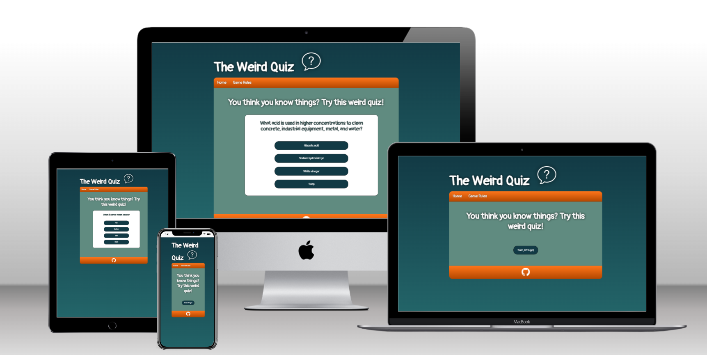
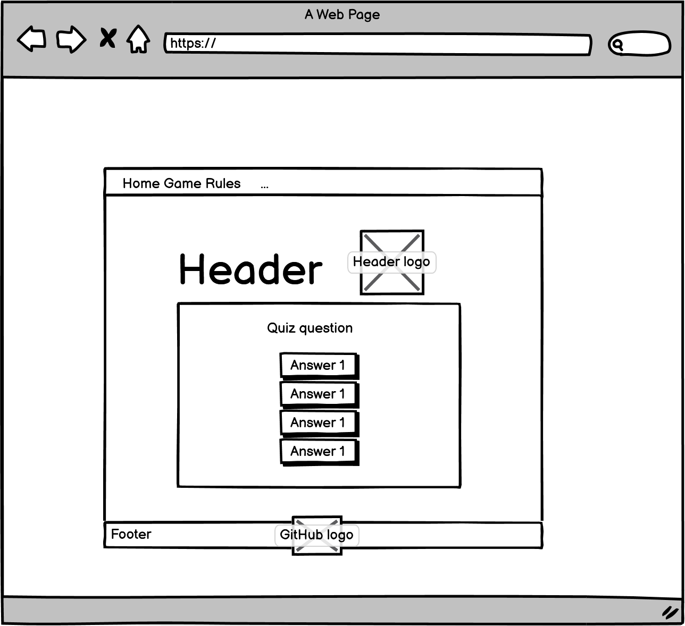
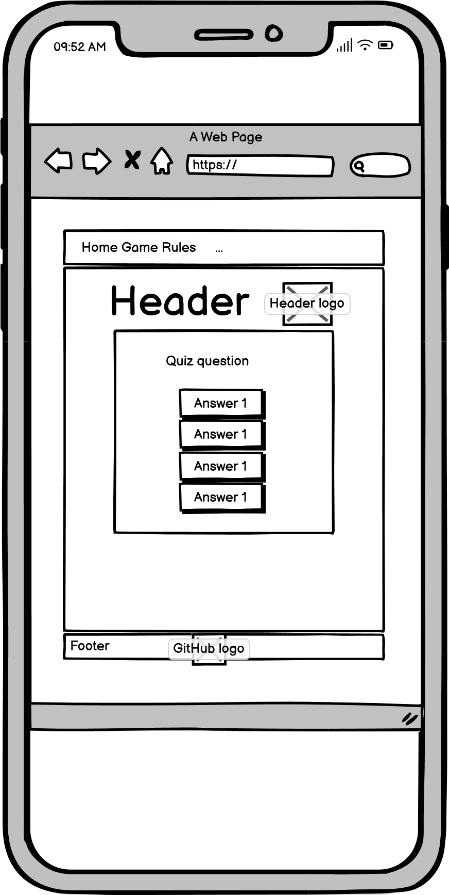
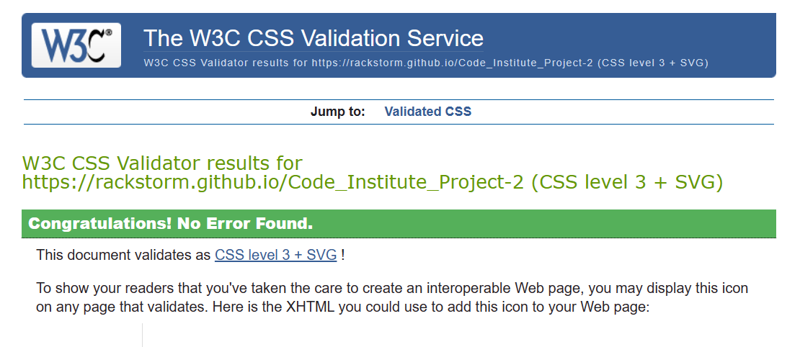
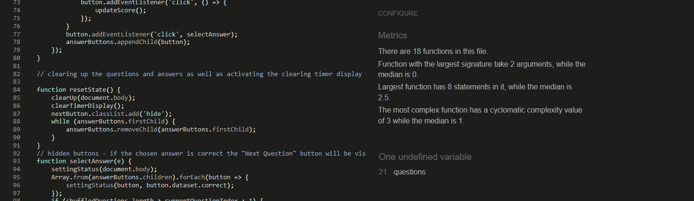
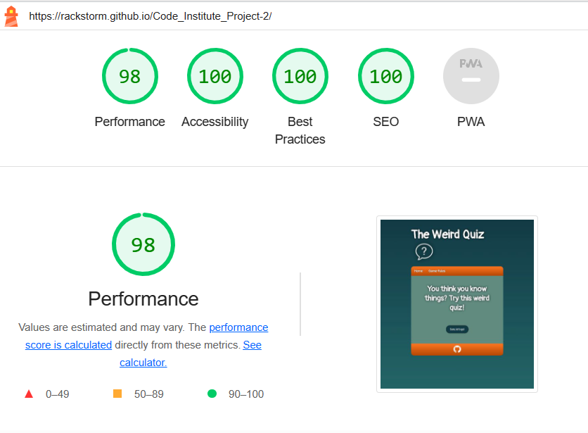

# The Weird Quiz - Project 2

The Weird Quiz is a short 5 question quiz site with more odd questions than the classic society/politics/music/film quiz. The homepage gives a simple expression, as do the functions with a stripped-down navigation menu with only two buttons - Home and Game rules.

The contrasts consist of a darker background and a navigation menu and footer that breaks off with an popping color. The font clearly tells that this is about a simple online game with no advanced intention or function.

# Design

- **Header** - A simple text and logo with a shadow effect to spark interest.
- **Nav bar** - Two functioning links to index.html and gamerules.html. A bright orange background color to create contrast.
- **Main** - The landing page contains a white header with a question that encourages the user to play the game. Color of background and text in great contrast.
- **Footer** - The same color as in the navigation bar to create a uniform impression. The footer is clean and stripped down on impressions with the exception of the GitHub logo with a working link to my GitHub profile. The link opens in a new window.

# Pages

- Index - Prompts the user to click the button to start the game and then presents the game, scoreboard and timer.
- Game Rules - Provides instructions on the rules of the game in a simple numbered list.

# Features

- Presents the game in its entirety along with the question, alternative answers, a timer. Finally, the final score and time it has taken the user to play the game are reported.

## Favicon

- Used an icon from [Icon 8](https://icons8.com/icons)
- Favicon was created through [Favicon Converter](https://favicon.io/favicon-converter/)
- The same favicon is used throughout every single page to make it easier for the user to recognize the website if they have other tabs open.

# Features to implement

1. Adding a "type in your name" feature to submit to make the quiz more personal.
2. Add more questions to the quiz.
3. Set up a multiplayer function to make things more interesting.
4. A 404 page.

# Design

## Wireframes

# Testing

- The website has been tested using the extension "Live Server" throughout the project in the IDE.
- Dev Tools has been used to check the responsiveness in different screen sizes as well as error codes.
- The project has been tested in different browsers such as Chrome, IE Edge, Firefox, Safari and Opera with no errors.
- The site has also been deployed to Git Pages and regurlarly been checked for errors.
- Testing has also been made in Jshint, Jigsaw, W3 Validator, Browserling, Wave and Lighthouse.

## Bugs

1. **Received error message "net::ERR_ABORTED"** - Wasn't sure whether it had to do with me or the fact that CodeAnywhere had Workspace issues at that particular time but after re-organizing the folders with the js and css files it functioned well afterwards. 2.**Couldn't load favicon site.webmanifest.** - Had issues with the I found a solution by using a tip from a [blog post on Medium](https://medium.com/@aurelien.delogu/401-error-on-a-webmanifest-file-cb9e3678b9f3).
2. **Faulty width-attribute on image** - Styled the image in the css instead of inside the img tag.
3. **Faulty property: list-style-type** - Deleted it completely out of the nav bar.

## Unfixed Bugs

1. **Timer** - Timer bugging and skips seconds sometimes. Ran out of time to fix it.
2. **Timed out** - Alert message pops up several times when timer is running out. Ran out of time to fix it.

## Validator Testing

### HTML - W3C validator

No errors were returned when passing through the official [W3C validator](https://validator.w3.org/nu/?doc=https%3A%2F%2Frackstorm.github.io%2FCode_Institute_Project-2%2F) the second time.

### CSS - Jigsaw Validator

No errors were found when passing through the official [Jigsaw](https://jigsaw.w3.org/css-validator/validator?uri=https%3A%2F%2Frackstorm.github.io%2FCode_Institute_Project-2%2F&profile=css3svg&usermedium=all&warning=1&vextwarning=&lang=en) validator the second time.

### JavaScript - JShint

No errors were returned when passing through the official [W3C validator](https://validator.w3.org/nu/?doc=https%3A%2F%2Frackstorm.github.io%2FCode_Institute_Project-2%2F) the second time. The questions are to be found in a separate file, hence the 'undefined variable'.

### Lighthouse

- Received score 98/100.
- Had 1 warning.

### Wave

Site has been tested at [Wave](https://wave.webaim.org/report#/https://rackstorm.github.io/Code_Institute_Project-2/) with good results. No errors or alerts.

# Technologies

- HTML is the main language of this project. CSS for styling in a separate file.
- JavaScript has been used for the quiz.
- The IDE used has been Codeanywhere with Code Institutes template.
- Git has been used to regularly adding, committing and pushing code to GitHub.
- All code and assets have been stored at GitHub.
- The project has been deployed through Git Pages.
- Favicon Generator has been used for the Favicons.
- Icon8 has been used for downloading the free favicon image.
- Wireframes have been designed in Balsamiq.

# Deployment

## Adding, committing and pushing code

- All code has been pushed to the repository https://rackstorm.github.io/Code_Institute_Project-2/
- All code has been regurlary added, committed and pushed throughout the project.
- The commands being used are `git add <file>`,
  `git commit -m “commit message”` and
  `git push`
- Due to being completely brand new into this tech world, the `git commit -m “commit message”` have gradually improved throughout this project since it was difficult for me to understand the importance of good logging in the beginning.

## GitHub Pages

1. Opened up the repository "Code_Institute_Project-2" on my profile.
2. Clicked on 'Settings' and scrolled down to 'Pages'.
3. Selected the 'Master Branch' and waited for the page to reload.
4. Page was successfully deployed to GitHub Pages.

Link to the project can be found [here](https://rackstorm.github.io/Code_Institute_Project-2/).

# Credits

All quiz questions and answers are from [Trivia Question Quiz](https://www.triviaquestionquiz.com/weird-trivia-questions-and-answers)

## Code

1. I've been using some animation effects on the css styling from [GreatStack's Javascript quiz tutorial](https://www.youtube.com/watch?v=PBcqGxrr9g8)
2. I've been using some code from [WebDev Simplified's Javascript tutorial](https://www.youtube.com/watch?v=riDzcEQbX6k)
3. For the timer and a deeper understanding of certain functions I've been using the help from [W3Schools](https://www.w3schools.com/js/default.asp) and reading maaaaany threads about peoples issues at [StackOverflow](https://stackoverflow.com/).
4. Got inspired by student [PdoyleC](https://github.com/PdoyleC/PP2-The-General-Quiz-Of-Everything).

## Images and Icons

1. The favicon icon is from [Icon8](https://icons8.com/) and has been converted with the [Favicon.ico converter](https://favicon.io/favicon-converter/).
2. The GitHub icon is from [PngAAA](https://www.pngaaa.com/).
3. The header icon is the same as the favicon and is from [Icon8](https://icons8.com/).

# Acknowledgement

- A massive **thank you** to my mentor Luke Buchanan for giving me pep talks in dark moments and providing good hints and aha-moments when I was struggling.
- **Thanks** to the tutor Josh who helped me finding a small error when my eyes were to tired to read spaghetti.
