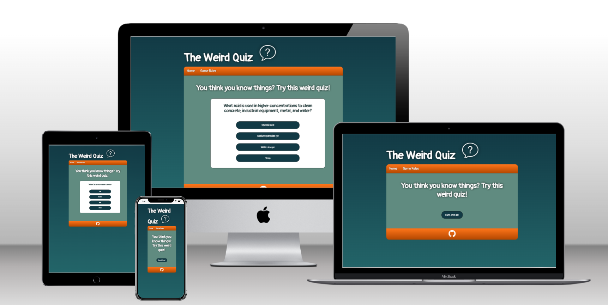

# The Weird Quiz - Project 2

TEXT

## Header

TEXT

## Navigation Bar

TEXT

## Main - Landing Page

TEXT

## The Footer

TEXT

# Pages and Features

## Favicon

- Used an icon from [Icon 8](https://icons8.com/icons)
- Favicon was created through [Favicon Converter](https://favicon.io/favicon-converter/)
- The same favicon is used throughout every single page to make it easier for the user to recognize the website if they have other tabs open.

TEXT

# Features to implement

1.
2.
3.

# Design

## Wireframes

PICTURES

# Testing

- The website has been tested using the extension "Live Server" throughout the project.
- Dev Tools has been used to check the responsiveness in different screen sizes.
- The project has been tested in different browsers such as Chrome, IE Edge, Firefox, Safari and Opera. The only one not being able to load the page (and completely timed out) was Opera.
- The site has also been deployed to Git Pages and regurlarly been checked for errors.

## Bugs

TEXT

## Unfixed Bugs

TEXT

### Navigation links

TEXT

## Validator Testing

### HTML - W3C validator

No errors were returned when passing through the official [W3C validator](https://validator.w3.org/nu/?doc=https%3A%2F%2Frackstorm.github.io%2FCode-Institute_Project-1%2F) the second time.

### CSS - Jigsaw Validator

No errors were found when passing through the official [Jigsaw](https://jigsaw.w3.org/css-validator/validator?uri=https%3A%2F%2Frackstorm.github.io%2FCode-Institute_Project-1%2F&profile=css3svg&usermedium=all&warning=1&vextwarning=&lang=en) validator the second time.

### Lighthouse

- Received score 91/100.
- Had some warnings and errors.

### Wave

Site has been tested at [Wave](https://wave.webaim.org/report#/https://rackstorm.github.io/Code-Institute_Project-1/) with good results. The only alert was that there is a
redundant link to the index.html. This because both the logo and the Home-button shares the same url.

# Technologies

- HTML is the main language of this project. CSS for styling in a separate file.
- JavaScript has been used for the quiz.
- The IDE used has been Codeanywhere with Code Institutes template.
- Git has been used to regularly adding, committing and pushing code to GitHub.
- All code and assets have been stored at GitHub.
- The project has been deployed through Git Pages.
- Favicon Generator has been used for the Favicons.
- Icon8 has been used for downloading the free favicon image.
- Wireframes have been designed in Balsamiq.

# Deployment

## Setting it up

TEXT

## Adding, committing and pushing code

- All code has been pushed to the repository https://github.com/Rackstorm/Code-Institute_Project-1
- All code has been regurlary added, committed and pushed throughout the project.
- The commands being used are `git add <file>`,
  `git commit -m “commit message”` and
  `git push`
- Due to being completely brand new into this tech world, the `git commit -m “commit message”` have gradually improved throughout this project since it was difficult for me to understand the importance of good logging in the beginning.

# Credits

1.
2.
3.
